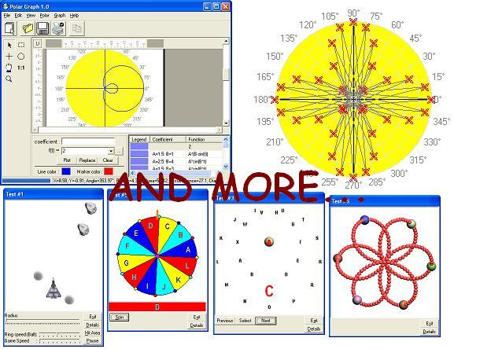



## Polar Graph 11/7/03 \(games and animations also included\)

### Description

Polar Graph is truly amazing. At first, I thought it was just a simple graph but when I start to program it and add some settings so that I can able to change the appearance of the graph, I was amazed with the result. I have found out that some of the games and animation that I have seen they have used polar graph. I also found out that it has many uses, of course, it depends on you. In my submission, I have included three programs (1) the polar graph itself, (2) games and (3) animation. If you want to learn more about polar graph then try to use this code. If you are a game programmer or if you like to make a very nice animation then this is what you are looking for. By the way, the games that I have included also help you on how to create a simple game.

If you like it guys...please vote!
 
### More Info
 

             |
---                |---
**Submitted On**   |2003-11-07 03:07:00
**By**             |[Aries Buenaventura](https://github.com/Planet-Source-Code/PSCIndex/blob/master/ByAuthor/aries-buenaventura.md)
**Level**          |Advanced
**User Rating**    |5.0 (174 globes from 35 users)
**Compatibility**  |VB 6\.0
**Category**       |[Math/ Dates](https://github.com/Planet-Source-Code/PSCIndex/blob/master/ByCategory/math-dates__1-37.md)
**World**          |[Visual Basic](https://github.com/Planet-Source-Code/PSCIndex/blob/master/ByWorld/visual-basic.md)
**Archive File**   |[Polar\_Grap1668941172003\.zip](https://github.com/Planet-Source-Code/aries-buenaventura-polar-graph-11-7-03-games-and-animations-also-included__1-49613/archive/master.zip)

